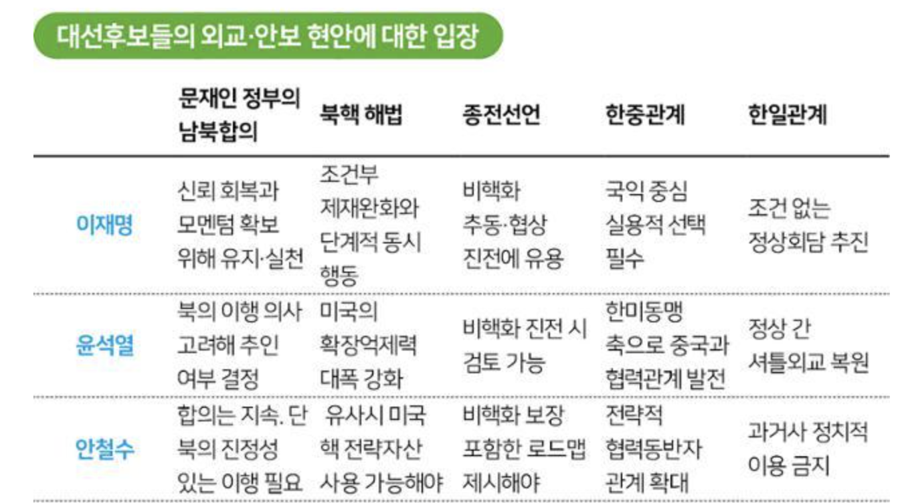

 

부동산 정책관련 부분에서는 안철수 후보의 공약이 가장 괜찮게 보였다. 그렇다면 나머지 정책 부문에서 각 후보들은 어떠한 비전을 제시하고 있는지를 마저 살펴보자.

 

#### 국제 통상 및 외교안보

우리나라의 외교와 안보에 가장 주요한 영향을 미치는 국가들은 북한, 미국, 중국 그리고 일본이다. 특히 북한은 우리나라와 가장 밀접하게 위치해 있으며 핵무장과 미사일 도발 등으로 정전 상태임에도 불구하고 꾸준하게 군사적인 위협을 가하고 있다. 군대를 억지로 끌려갔다온 내 입장에서도 후보들의 대북정책은 정말 중요하게 생각하는 안보 이슈이다. 

대북정책과 관련하여 가장 핫한 키워드는 "종전선언"일 것이다. 뚜렷한 성과가 없는 문재인 정부 입장에서 종전선언은 굵직한 성과로 보여질 수 있기 때문에 "6.25 한국 전쟁의 종전선언이 한반도 평화의 시작"이라는 의미를 부여하며 열심히 추진하려고 한다. 종전선언을 통해 그럼 달라지는 것이 있을까? 북한은 여전히 핵을 개발할 것이고, 오히려 종전이라는 것을 빌미로 한미 연합과 군사협동훈련에 이의제기를 할 수있다. 애초에 "종전선언"이 한반도의 평화에 기여하는 바는 굉장히 미미할 것이다. 북한이 종전선언을 무겁게 여길 것이라는 것을 누가 보장할 수 있을까? 비핵화와 북한의 합의 이행 조건이 우선적으로 이루어 져야 한다는 것이 내 생각이다. 

이재명 후보의 "대화로 풀겠다", "할말은 하겠다"라는 모호한 말과 함께 기존 문재인 정부의 남북 간 합의를 유지·계승하겠다는 것은 도대체 어떻게 다른 정책을 펼치겠다는 것인지 이해하기가 어렵다. 종전선언을 빌미로 비핵화를 추동한다는데, 과연 북한이 이를 순순히 따라줄지가 의문이다. 핵은 북한의 입장에서는 생명줄이자 최선의 보호 수단이다. 따라서 종전선언을 한다고 해도 포기를 할 가능성은 매우 적어보인다. 

윤석열 후보는 매우 강력한 대북정책을 지향하고 있다. 한미간의 긴밀한 협력을 강조하며 북한과의 대화 보다는 거리를 두려하고 있다. 북한의 진정성 있는 의사가 있어야 남북합의 방향을 결정하겠다는 입장을 취하고 있어 좀 더 합리적인 것 같다. 우리나라의 자체 핵무장에 대해서 나머지 두 후보는 반대했지만 안철수 후보는 미국의 핵 전략자산을 사용하는 방안에 대해 검토를 해야한다는 입장을 취하고 있다. 

개인적으로 나는 한 국가의 국방을 동맹국에 맡기는 것은 말이 안된다고 생각한다. 미국은 베트남 전쟁에서 패했으며, 자국의 이득에 따라 동맹국 지원 여부를 결정했다. 아무리 한미 연합 훈련을 하고 미국의 핵우산의 보호를 받는다고 해도  국방은 자주적인 역량 강화를 해야한다. 북한이 섯불리 한국을 공격하지 못하는 것은 미군이 뒤에 있기 때문이다. 미국이 모종의 이유로 지원을 하지 않거나 한국에서 철수를 한다면 대한민국의 안보는 심각한 위기와 긴장감에 놓이게 될 것이다. 하지만, 자체 핵무장은 현실적으로 불가능하다. 선진국들의 동의를 얻기는 매우 힘들 것이며 들키지 않고 몰래 개발을 하는 것 또한 가능성이 희박하다. 무역에 크게 의존하는 경제체재를 갖춘 나라로서 북한이나 이란과 같은 경제적 제재가 들어온다면 핵무장으로 인한 이득보다는 경제적 손실이 더 클 것이다. 따라서, 대북정책과 안보 측면에서는 윤석열 후보의 손을 들어주고 싶다. 

나머지 3개 국과 관련해서는 일본과의 외교 정책은 세 후보가 크게 다른 점이 없어 보인다. 주로 친일의 성격을 보이는 것으로 생각된다. 다만, 중국과 미국에 대해서는 상반된 반응을 보이는 것 같다. 이재명 후보는 친중 성격이 강하며, 중국 매체에서도 이재명 후보에 대한 관심을 더 보이고 있다. 반면 윤석열 후보는 친미에 더 아까우며 사드배치 등의 발언으로 중국과는 거리를 좀 두는 정책을 펼칠 것 같다. 안철수 후보 또한 대중국 3불 정책의 폐기를 약속하는 것으로 친중에서 벗어나는 정책 기조를 보였다. 여태까지 문재인 정부가 펼친 친중 정책이 국익에 크게 도움되지 않았다는 점을 감안하면, 중국이 국제사회에 미친 부정적인 영향들을 고려한다면 그리고 우리나라의 안보가 미국과 밀접한 연관이 있다는 것을 생각하면 기본적인 정책 기조를 친미로 가져가는 것이 옳다고 생각한다. 

종합적으로 봤을 때, 대북정책과 외교관련 해서는 윤석열 후보가 가장 마음에 든다.

승자: **윤석열**

 

#### 사회문제

##### 국민연금 개혁

국민연금이 2054~2057년 쯤 재정이 고갈된다는 것은 익히 알려진 사실이다. 따라서 90년대 생들은 연금을 내기만 하고 받지 못하는 세대가 되어버린다. 월급의 9%가 보험료로 꾸준히 공제되지만 막상 받을 나이가 되면 못받게 되어버린다. 연금개혁과 관련된  공약은 현재 거의 전무한 상태이다. 안철수 후보만이 공무원연금·군인연금과 국민연금을 통합하겠다고 하며 주요 공약으로 내세웠다. 사실 연금개혁의 핵심은 보험료 인상에 달려있으나, 이 부분은 오히려 표를 깎아먹는 주장이기 때문에 후보들이 선뜻 얘기를 꺼내지 않는 것 같다. 

##### 저출산 문제

가장 심각한 사회문제가 아닐까 싶다. 우리나라 출산율은 가임여성 1명당 0.84명, 합계 출산율은 30만명으로 세계 최저급이다. 예로부터 국력은 인구의 수와 큰 상관관계를 가지고 있었다. 전쟁을 할 때도 병력의 수는 승패를 가르는 절대적인 요소였고, 세계 정세의 패권을 쥐고 있는 미국, 중국, 러시아 또한 많은 인구 수를 가지고 있다. 저출산 고령화 문제는 내가 군대에 있었던 2016년 이전 부터 지속적으로 얘기가 나오고 있었다. 하지만 약 6~7년간 진전 자체가 없었다. 생산가능인구는 점점 줄어들고 있지만, 고연령층은 지속적으로 늘고 있다. 

이재명 후보의 경우 저출산 관련하여 사회초년생의 내 집 마련곽 육아 부담 해소, 안정적인 고용 여건을 확보하는 공약을 내세웠다. 2030세대의 경제적 어려움을 해결하는 것으로 저출산 문제를 해결하겠다는 기조이다. 안철수와 윤석열 후보는 출산과 임신, 보육 관련 문제를 해결하겠다는 다소 현실적이지만 뻔한 공약을 했다. 윤석열 후보는 초등학생 돌봄 시간을 늘리겠다는 공약을 했고, 안철수 후보는 후보가 퇴근하기 전 까지 방과후 수업을 운영하겠다고 공약했다.

 

<iframe width="1190" height="678" src="https://www.youtube.com/embed/fJl2OLk6Kh8" title="YouTube video player" frameborder="0" allow="accelerometer; autoplay; clipboard-write; encrypted-media; gyroscope; picture-in-picture" allowfullscreen></iframe>

위의 영상에 따르면 국민채점단의 블라인드 평가는 이재명 후보의 공약에 가장 높은 점수를 주었다. 하지만, 이는 의미없는 점수라고 생각된다. 아이를 낳지도 않고 낳을 생각도 없는 상황에서 초등 돌봄 교육과 방과후 퇴근 활동에 대한 공약이 의미가 있을까? 오히려 집과 워라밸을 보장해준다는 공약이 개인에 이해와 직결되기 때문에 더 매력적으로 느껴질 것이다. 조사의 설계가 유권자들의 "표심"에만 초점이 맞춰져 있다는 생각이 들었다. 

사실 살기 좋은 나라를 만든다면 출산율은 자연스럽게 증가할 수 밖에 없다. 미래에 대한 비전이 없는 대한민국에서는 어떤 정책으로도 사람들이 아이를 낳게끔 회유할 수 없을 것이다. 본 문제의 해결을 위해서는 미래에 대한 명확한 비전을 제시하는 후보를 선정해야할 것 같으므로 판단을 유보해야겠다.

>  "일개미는 알을 낳지 않는다"

 

#### 과학기술 정책

아직까지 자료 및 데이터가 부족하다.

#### 기타

### 정리하면서

아직 완벽하게 잘 정리된 공약모음집이 나오지 않아서 정확한 판단을 하기는 어려울 것 같다. 다만 굵직굵직한 공약들을 살펴 본 결과, ㅇㅇㅇ후보가 내 기준에서는 최고의 후보로 결정이 됐다.

하지만 아직 대선 까지는 시간이 좀 있어서, 좀 지켜봐야할 것 같다. 이번 선거는 차악을 선택하는 것이 아닌, 소신껏 최고의 선택을 하고자 한다. 