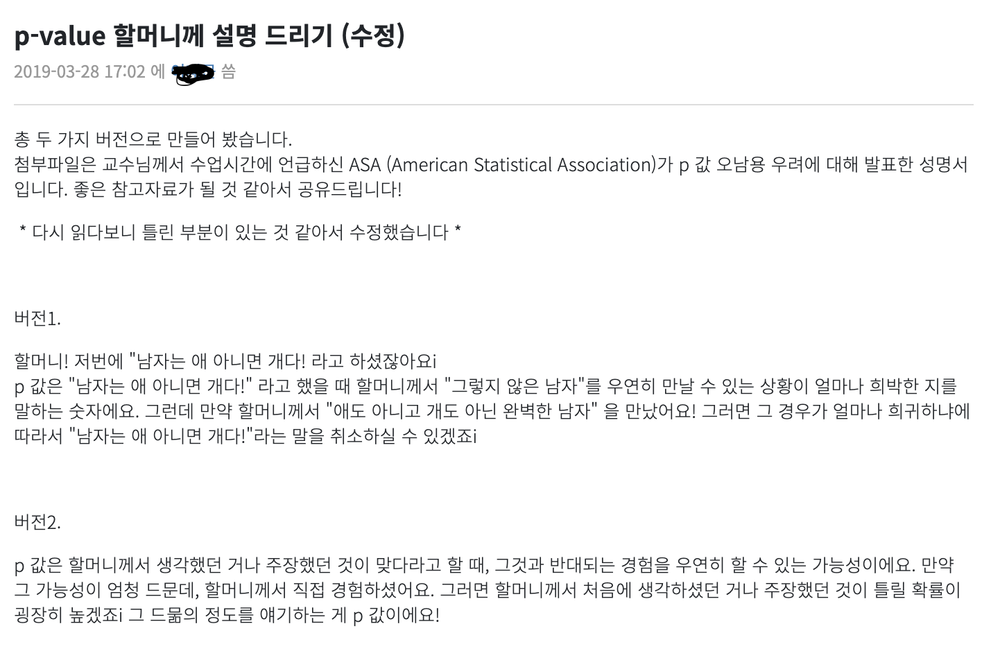

 

대학교를 졸업한지 벌써 3년이 다 되어간다. 4년의 대학생활 동안 취득한 학점은 139학점이나 되지만, 비싼 등록금을 내고 기억에 남는 것들은 사실 많지가 않다. 하지만 불현듯 수업시간에 했던 과제 내용이나 교수님들께서 하셨던 말씀이 영화 속의 회상씬처럼 떠오르는 경우가 있다. 

지난달, 여자친구가 술에 크게 취해서 자기 몸 조차 제대로 가누지 못했는데, 여자친구 본인은 원래 술을 그렇게 까지 마시지 않는다는 주장을 했고, 평소에는 적당히 마시고 집에 항상 잘 귀가를 한다는 얘기를 했다. 그날은 살면서 손에 꼽을 정도로 술에 취했었다는 말을 듣고나서 나는 여자친구에게 이렇게 말을 했다:

> 네가 평소에는 적당히 마시고 취하지 않은 상태로 집에 잘 귀가를 한다고 하는데, 그러면 어제 내가 본 자기의 만취 상태는 살면서 한번 쯤 볼까말까 한 그런 모습인거야? 어 이거 그럼 p-value가 몇이나 되는거지? ㅋㅋㅋㅋ

정말 뜬금 없게 "이 상황에서는 p-값이 과연 얼마나 될까?" 라는 이상한 의문이 들었다. 그리고 p-value가 뭐냐고 묻는 여자친구의 말을 들으면서 수업시간에 배웠던 p 값에 대한 생각이 났다.

 

p-값을 다룬 통계수업은 굉장히 많았는데, 보통 p-값 혹은 유의확률의 정의는 대부분 딱딱하게 다음과 같이 설명을 했었다: 

> 귀무가설이 맞다고 가정할 때, 얻은 결과보다 극단적인 결과가 실제로 관측될 확률

그리고 항상 아래와 같은 그래프가 칠판에 그려졌었다:

 

하지만 내 기억 속에 그려진 회상 장면은 통계자료분석에서 교수님이 내주신 과제에 대한 내용이었다. 

> 다들 4학년이면 p-값이 무엇인지에 대해서는 수학적으로 설명할 수 있겠죠? 그런데 사회에 나가서는 전공자가 아니고서야 다른사람에게 p-값을 설명하는 것이 굉장히 어려울 거에요. 여러분의 상사가 수학을 포기한 사람이라 생각하고 p-값을 설명해보세요. 아! 그것보다는 할머니 할아버지께 p-값을 어떻게 설명해드릴 건지 고민을 해보시고 온라인 게시판에 글을 올리세요. 잘 쓴 사람에게는 추가점수를 드릴께요.

그리고 나는 그 당시에 아래와 같이 설명을 했다.

교수님께서는 내 설명에 유의수준에 대한 내용, 즉 $\alpha$ 에 대한 설명이 빠진 것이 아쉽다고 하시고 별다른 코멘트를 하지 않으셨다. 이때 나름 많이 고심하여 작성을 한 것 치고는 피드백이 짧아 아쉬운 마음이 들었던 것이 기억났다. 

이러한 짧은 과제에 대한 아쉬움으로 인해서 나 p-값에 대해서 더 오래 기억할 수 있었고, 통계와는 거리가 먼 여자친구도 이해를 시킬 수 있을 정도의 설명을 할 수 있었다. 이번에 나는 여자친구에게 $\alpha$ 에 대한 설명을 추가해서 p-값을 설명했다.

> 자기가 술을 잘 조절해서 먹고 평소에 멀쩡하게 귀가를 한다는게 사실일 때, p-값은 어제처럼 술이 떡이 되도록 마신걸 내가 목격을 했을 확률이라고 생각하면 돼 ㅋㅋㅋ 
>
> 그리고 여기서 유의수준이라는 $\alpha$ 라는 값이 있는데, 이건 내가 자기의 말을 사실로 받아들일지 말지 결정할 내가 정한 임의의 기준확률이야. 내가 자기 말을 믿고 평소에 자기가 술 조절을 아주 잘한다고 생각해서 1000번 중에 1번 일어날 일이라고 생각을 했으면, 어제본 자기의 모습은 엄청 충격적이었겠지?
>
> 그니까 p-값이 $\alpha$ 보다 작으면, 자기가 하는 주장을 받아들이기가 어렵다는 얘기야. 물론 자기가 말한 것 처럼 살면서 한번 쯤 볼까말까한 우연일 수도 있겠지만, 통계적으로 봤을 때는 믿기가 어렵다는 소리야 ㅎㅎ 
>
> 한줄 요약: p-값은 **자기가 하는 주장이 맞는대도 어제 본 일 때문에 내가 그걸 믿지 않았을 때, 내가 틀렸을 확률이야**

 

장황하게 설명을 하고 난 뒤 집에 돌아와서는 뿌듯함보다는 아쉬움이 남았다. 이유에 대해서 곰곰이 생각을 해보니 내 설명에는 p-값의 함정에 대한 설명이 빠져있었다! 다음에 누군가에게 p-값에 대한 설명을 할 때는 아래 내용을 포함하여 좀 더 완벽하게 얘기를 할 수 있도록 다시 다짐을 해봤다. (내가 봐도 나는 nerdy한 부분이 좀 있는 것 같다 ㅎㅎ;)

> p-값을 가끔 잘못 사용하는 사람들이 있는데, 예를 몇가지 들어보자면, 내가 어제 본 일 때문에 자기가 하는 "멀쩡하게 잘 들어간다는" 주장을 믿지 않는다고 해서 "자기가 술을 마실 때 마다 인사불성이 된다"는 근거로 쓸 수 있는 건 아니야. 그냥 "의심을 해볼만 하다"는 수준으로 받아들여줘 ㅎㅎㅎ

 

앞으로 건강을 위해 술은 적당히(?) 마시자... ^^

