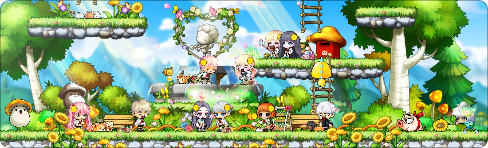

### 넥슨과의 첫 만남

내가 처음으로 즐긴 온라인 게임은 메이플스토리였다. 

게임을 할 수 있는 시간이 주말에 딱 1시간으로 정해졌었던 초등학교 시절에 원하는 능력치를 얻기 위해 1시간 동안 종일 주사위를 굴렸었다. 좋은 아이템을 준다는 말에 현혹되어 사기를 당하기도 했고, 계정을 해킹당해 울기도 했었다. 아버지가 발령이 나셔서 캐나다로 같이 따라갔을 때도 새벽에 몰래 메이플스토리를 했고, 대학생이 되어서도 친구들과 함께 추억에 빠지면서 메이플스토리를 즐겼다. 심지어 석사 과정을 밟으면서도 글로벌 메이플스토리가 궁금해서 플레이를 했고 이는 외로운 유학생활에 작은 기쁨이 되어주었다. 

물론 메이플 말고도 많은 게임을 하며 시간을 보냈지만, 3D게임이 멀미가 나고 단순한 것을 좋아하는 내 성격 상 메이플의 그래픽이 주는 안정감은 독보적이었다. 그만큼 애착이 가고 애틋한 게임이었다. 방학 때마다 연어처럼 메이플을 다시 설치하는 내 자신을 보여, 메이플이 담배와 같이 느껴졌다.

> 메이플은 끊는 것이 아니라 잠시 쉬는 것이다

하지만 정작 메이플스토리를 서비스하는 넥슨에는 큰 관심이 없었다. 돈슨이라는 대외적인 이미지 때문에 그다지 알고 싶은 회사가 아니었다. 

그런데 어느순간 정신차려보니, 나는 넥슨에 입사해서 게임 데이터를 보며 지표 관리를 하고 있었다. 

 

### 첫 취업: 넥슨 코리아 -글로벌성장전략팀

캐나다에서 석사 유학을 하면서 난 열심히 취업준비를 병행했다. 20개가 넘는 지원서를 넣었지만, 돌아오는 연락은 없었다. 그 와중에, Boeing에서 회신이 왔고 나는 두 번의 면접을 볼 수 있었다. 

면접의 분위기는 매우 좋았고, 그 자리에서 본 기술/직무 인터뷰도 막힘없이 잘 해냈었다. 이 다음 라운드는 없고 합격, 불합격 여부만 있을 것이라고 통보를 받았고, 웬만해서 기대를 하지 않는 나는 김칫국을 열심히 마시며 기숙사에 들어갔다. 하지만, 약속된 2주 후에도 연락은 없었고, 거의 4주가 지나서 아래와 같은 메일이 왔다.

"...we will no longer be filling this position." 내정자가 있었는지, 코로나의 여파로 회사가 어려워 채용 공고를 내려버린 것인지, 그냥 일반적인 불합격 통보인지는 모르겠지만 행복회로를 잔뜩 돌리고 있던 내게는 충격이 컸다. 그리고 도망치듯 석사를 수료하고 한국으로 돌아왔다.

한국으로 돌아온 나는 코로나로 인해 2주 동안 자가격리를 해야했다. 백수가 격리 기간 동안 할 수 있는 게 뭐가 있을까? 나는 다시 메이플스토리를 설치하고 열심히 게임을 했다. 그리고 우연찮게 넥슨에 데이터 분석을 할 수 있는 포지션을 찾았고, 그대로 한국에 온지 2달 만에 첫 직장을 구했다. 

 

### 넥슨 with 코로나

첫 직장인만큼 기대 또한 컸었다. 팀 사람들과 친하게 지내고 싶었고, 회식도 하고 싶었고, 타 부서 사람들과 커피타임도 가지는 직장 생활을 기대했었다. 하지만, 글로벌성장전략팀은 신설된 부서였으며 구성원이 나와 실장님 단 둘 뿐이었다. 게다가 코로나로 인해서 다들 재택 근무를 하고 있던 터라 사무실 또한 텅텅 비어있었다. 나 또한 2주 후에는 재택근무로 전환이 되었다. 그리고 나의 첫 회사생활에 대한 환상은 산산조각이 났다. 

코로나 때문인지, 아니면 부서의 특성 때문인지는 모르겠지만 넥슨에서 약 1년 6개월 동안 일을 하면서 소속감을 느낀적이 없었다. 새로운 팀원들이 합류하면서 팀이 4명으로 커지긴 했지만, 각자 맡은 일이 뚜렷했기 때문에 업무시간에 서로 얘기를 할 기회가 별로 없었고 사적 대화도 자제가 된 상황에서 친분을 쌓기가 어려웠다. 지금도 회사에서 편하게 말을 걸 수 있는 사람이 우리 팀원을 제외하고는 없다. 가뜩이나 내성적이고 소심한 성격이라 사람들과 친해지기가 어려웠는데, 코로나의 여파와 단절된 팀 속에서 나는 외로움을 심하게 느꼈다. 다른 회사로 이직을 결심한 가장 큰 이유 중 하나였지만, 괜히 부적응자로 낙인이 찍힐까봐 누구에게도 말하지 않은 이유였다. 

아래 조사에 따르면 재택 근무의 가장 큰 어려움 중 하나는 외로움이라는 결과가 있기도 했다. 신입으로서 재택근무를 하며 겪었던 어려움과 매우 relatable해서 공감이 갔다. 

 

### 넥슨에서 배운 것들

많은 사람들과 소통하고 친분을 다질 기회는 없었지만, 다른 소중한 경험과 지식을 얻었다.

가장 첫 번째로 배운 것은 퍼포먼스 마케팅과 그로스 해킹에 관련된 지식이었다. 그로스 해킹의 해적 지표라 불리는 AARRR 모델에 대한 데이터가 어떻게 적재되고 있는 지 파악할 수 있었고, 꾸준히 모니터링을 하면서 지표에 대한 감각을 익힐 수 있었다. 수학에는 어느정도 자신이 있었지만, 숫자에 대한 감이 뛰어나지는 않았던 내게는 좋은 경험이었다. 

> 0이 5개가 넘어가면 읽기가 좀 힘들었는데, 이제는 0이 많아도 한번에 얼마인지 파악할 수 있게 됐다.

모바일 광고 업계 체계에 대해서 알 수 있었고, UA팀의 리포트를 받아보면서 디지털 마케팅에 대해 배울 수 있었다. CPI, CPA 등 광고 단가 지표에 대한 이해, 광고가 노출되는 구조, 광고 비딩에 대한 원리를 숙지하면서 Acquisition 측면에 대해 깊게 알게 된 것 같았다. 

두 번째로 배운 것은 나무가 아닌 숲을 보는 시각이었다. 임원 직속 전략 부서로서 정보열람 권한이 많았기 때문에, 타 부서 부장급도 알고 있지 못한 프로젝트 내용과 각종 리서치 자료에 대한 Visibility가 있었다. 그래서 현재 회사가 어떤 프로젝트를 진행하고 있는지, 방향성이 어떻게 되는지를 볼 수 있었고, 보고 체계에 대한 커뮤니케이션을 이메일로 받아보면서 회사가 어떻게 운영되고 있었는지를 확인할 수 있었다. 항상 하나에 빠지면 몰두하는 성격 탓에 숲이 아니라 나무만 집중해서 보는 습관이 있었는데, 이번 기회에 다양한 게임 타이틀의 지표를 모니터링하면서 우선순위를 설정하는 법을 배우게 되었고 숲에서 가장 중요한 나무들을 챙겨보는 습관을 기를 수 있게 되었다. 

마지막으로 배운 것은 블록체인에 대한 지식이었다. P2E, NFT, 메타버스 그리고 블록체인과 가상화폐에 대한 관심이 커지자 팀 내에서 가장 기술 이해도가 높은 블록체인 리서치를 내가 주도하는 상황이 많이 발생했다. 관심있는 주제로 리서치를 하면서 월급도 받아갈 수 있다는 것이 만족스러웠다. 지난 6개월 간, 블록체인 리서치를 하면서 해당 산업에 대한 이해를 높일 수 있었다는 점에서 내 렌즈의 크기를 키웠다고 느꼈다. 

 

### 새로운 여정을 향해

데이터 분석의 전문성을 기르기 위해, 증권사의 데이터가 궁금해서 그리고 연봉을 더 많이 주기 때문에 이직을 결심했고 퇴사 통보까지 마친 상황이지만 마음 한 구석이 불편하다. 

이성적으로 생각했을 때는 당연한 선택이었지만, 그래도 나름 넥슨에 정이 들었었나보다. 사실 넥슨에서의 회사 생활이 외롭긴 해도 다른 친구들의 삶에 비해서는 매우 여유로운 편이었다. 이제 편안하고 안락한 삶을 청산하고 치열한 전장 속으로 들어가는 마음이라 불안한 마음이 없지않아 있다. 대학교 3학년 부터 데이터 분석을 하고 싶어 열심히 달려왔지만, 넥슨에서의 1년 반은 커리어 상으로는 휴식기였다. 그동안 쌓아왔던 통계지식과 코딩 스킬이 녹슬지 않도록 열심히 블로그 포스팅도 하고 책 리뷰도 썼지만, 현업에서 업무를 문제없이 잘 수행해낼 수 있을 지에 대한 두려움이 조금은 있다. 

달콤한 꿈을 뒤로하고 현실을 마주하게 된 나의 새로운 여정이 재밌고 보람차기를 바랄 따름이다.