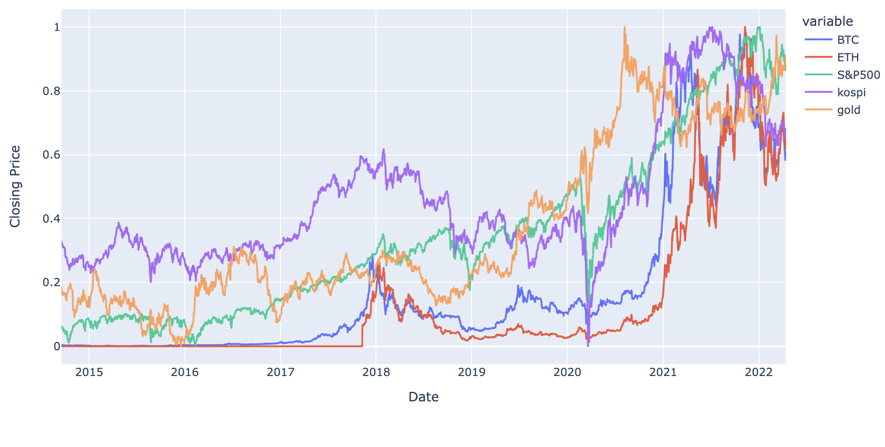

 

최근에 흥미로운 기사를 봤다. 비트코인의 가격 그래프와 나스닥, S&P500의 상관관계가 2020년도에 들어서 크게 높아졌다는 이야기였다. 

비트코인은 4년마다 Halving (반감기)를 통해 공급량이 줄어들고, 시간이 흘러도 손상이 되지 않는다. 다시말해 가치저장 자산의 두가지 특징인 희소성과 영원성을 가지고 있어 "디지털 금"으로서의 역할을 수행하고 있었다. 하지만, 비트코인이 점점 글로벌 증시가 비슷한 커플링 현상을 보이고 있어 안전자산이 과연 맞을까라는 의문을 제기했다. 실제로 금리 인상이 예고 될 때 마다 비트코인 가격은 주식시장과 함께 추락했고, 비트코인과 주식시장의 종합지수간의 높아진 상관관계에 대한 분석글을 다수 확인할 수 있었다.  

<figure>
  
  <figcaption style='text-align: center;'>Bitcoin Stock Correlation 검색 결과</figcaption>
</figure>
지금까지 확인한 기사들은 S&P500 지수, 나스닥 지수와 비트코인 가격의 상관관계가 늘어나고 있다는 것을 Pearson Correlation을 이용한 데이터로 해석한 것 같았다. [블룸버그의 기사](https://www.bloomberg.com/news/articles/2022-04-11/bitcoin-s-correlation-with-big-tech-increases-to-record-chart)에서 사용된 데이터는 아래와 같았다. 2020년 부터 양의 상관관계가 지속적으로 유지가 되고 있었고, 2021년 후반부터 현재까지는 0.6에 육박하는 상관관계를 보여 주가 지수와 비트코인의 커플링이 점점 더 심해지고 있다는 주장을 했다.

하지만 데이터의 출처, 상관계수 분석 방법 등 그래프가 어떻게 그려졌는지 상세하게 기술되지 않은 상황에서 위의 내용을 전부 신뢰하기는 어렵기 때문에 직접 분석을 해보기로 했다. 

 

## 데이터

필요한 데이터는 네이버 금융, 야후 파이낸스 그리고 구글의 검색을 통해서 수집했다. 각 데이터의 출처는 아래와 같다:

- 코스피 지수: https://finance.naver.com/sise/sise_index_day.naver?code=KOSPI | [데이터](../notebook_code/kospi.csv)
- S&P 지수: https://finance.yahoo.com/quote/%5EGSPC/ | [데이터](../notebook_code/SP_500.csv)
- 비트코인 가격: https://finance.yahoo.com/quote/BTC-USD?p=BTC-USD | [데이터](../notebook_code/BTC.csv)
- 이더리움 가격: https://finance.yahoo.com/quote/ETH-USD?p=ETH-USD | [데이터](../notebook_code/ETH.csv)
- 금 가격: https://www.gold.org/goldhub/data/gold-prices| [데이터]((../notebook_code/Gold.csv))

자세한 크롤링 및 분석 코드는 [jupyter notebook](../notebook_code/crypto_stock_correlation.ipynb)에 기록했다.

 

## 시각화

MinMax Scaling을 이용하여 각 지수 및 가격 그래프의 y축을 0에서 1로 고정시켜봤다. 비트코인과 이더리움은 매우 유사한 패턴을 보이고 있으며, 코스피와 S&P500 지수 또한 얼추 유사한 형태를 보이고 있다. 금의 가격은 주식 지수와는 반대로 움직이는 경향 또한 확인할 수 있다.  

 

### 상관관계 분석

